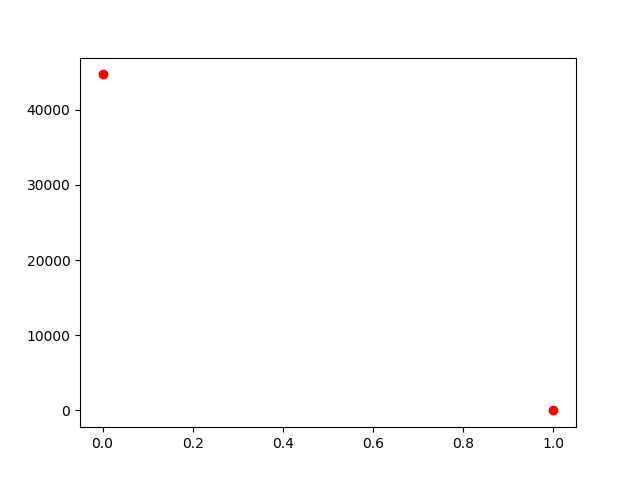
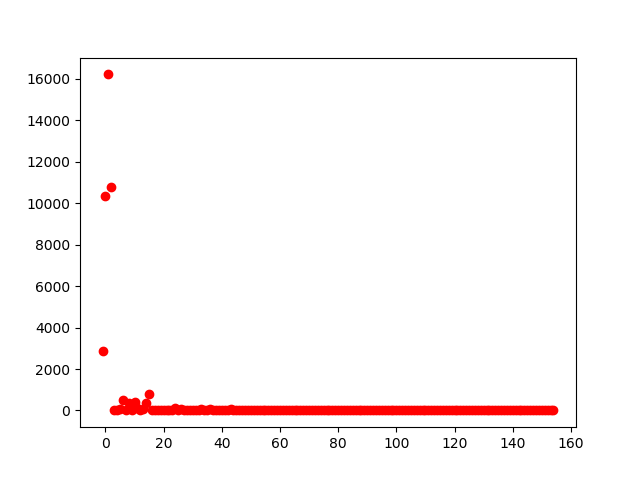
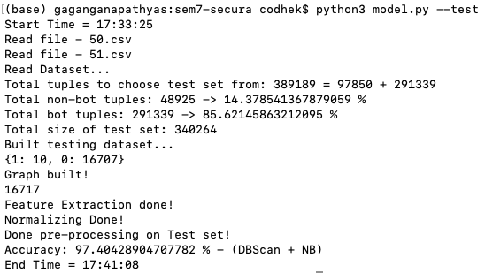
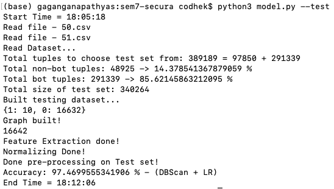
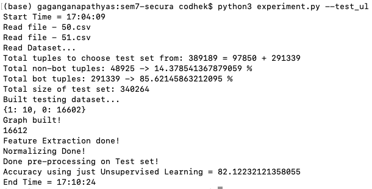
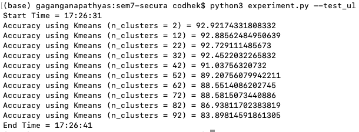

# mitiBot
A Graph based machine learning approach to bot mitigation systems.

### Datasets

Just run `setup.sh` to download the `training` and `testing` datasets. The datasets get downloaded into the `./datasets` folder.

### Using the data files

```
b = Build(['42.csv', '43.csv', '46.csv', '47.csv', '48.csv', '52.csv', '53.csv'])
```

Just pass the file names, it will read the files from the `./datasets` directory and load the data.


### e2e mode

To perform both `training` then `testing` use the `e2e` flag.

```
python3 model.py --e2e
```

Configuration used in the e2e mode:

```
# Training dataset

b = Build(['42.csv', '43.csv', '46.csv', '47.csv', '48.csv', '52.csv', '53.csv'])
b.data = b.build_train_set(b.non_bot_tuples, b.bot_tuples)
b.preprocess()

train_p1()
train_p2()

# Testing dataset

t = Build(['50.csv', '51.csv'])
t.data = t.build_test_set(t.non_bot_tuples, t.bot_tuples, 50)
t.preprocess()

test()
```

Total time:
```
  Avg: ~45m
```


### k-fold mode

Perform K-fold cross-validation on the 9 datasets using the `--kfold` flag.

```
We use:

datasets = ['42.csv', '43.csv', '46.csv', '47.csv', '48.csv', '50.csv', '51.csv', '52.csv', '53.csv']

In each iteration we use one of the datasets for testing and the rest for training.

$ python3 model.py --kfold

```

Takes about `~8 hours` in total to complete! (Check [logs](https://github.com/CodHeK/mitiBot/blob/master/kfold.logs))

In the end prints the average accuracy for Logistic Regression and Naive Bayes using DBSCAN in phase 1.

DBSCAN + LR | DBSCAN + NB
:-------------------------:|:-------------------------:
97.46%  |  97.29%

### Training

You can train the model in 2 ways, as it has PHASE 1 (UNSUPERVISED) and PHASE 2 (SUPERVISED)

This will peform both the phases one by one.
```
python3 model.py --train
```

If you want to perform the 2 phases separately `(given the feature vectors are already saved in f.json and fvecs.json)`

```
python3 model.py --phase1
```

and

```
python3 model.py --phase2
```

Once trained, it creates the pickle files of the model and saves it in the `saved` folder which is then used for the testing.

NOTE:

You could directly used the saved `feature vectors` store in the JSON format in folder `saved_train` and directly train `phase2` of the training process inorder to fasten the training process!

The above, weights saved are trained on the following data files: `['42.csv', '43.csv', '46.csv', '47.csv', '48.csv', '52.csv', '53.csv']` in case you want to modify you'll have to train `phase1` first whose weights once trained will we saved in the `/saved` folder.


### Testing

Using the command below will use the pre-trained classifier saved in the pickle file in the `saved` folder.
```
python3 model.py --test
```

### Cluster size maps
#
 Kmeans (n_clusters=2, random_state=0) | DBScan (eps=0.4, min_samples=4)
:-------------------------:|:-------------------------:
  |  

### DBSCAN + Naive Bayes Classifer

Tested on the data files `50.csv` and `51.csv`.
#
Test run:
#

#
Test time:
```
  Avg: ~7m
```

### DBSCAN + Logistic Regression Classifer

Tested on the data files `50.csv` and `51.csv`.
#
Test run:
#

#
Test time:
```
  Avg: ~6m
```

### Experimenting

Using only Unsupervised Learning as our learning technique we get :

#### DBScan (eps=1.0, min_samples=4)

Clustering on the data files `50.csv` and `51.csv`



### Using various number of clusters for KMeans

Clustering on the data files `50.csv` and `51.csv`




### Reference

The following code is the implementation of the [paper](https://arxiv.org/pdf/1902.08538.pdf)
with slight modifications.
