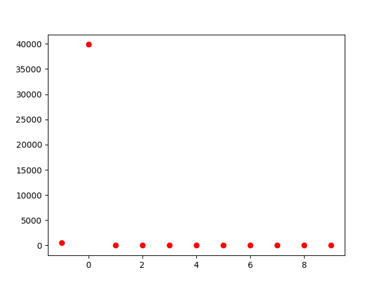
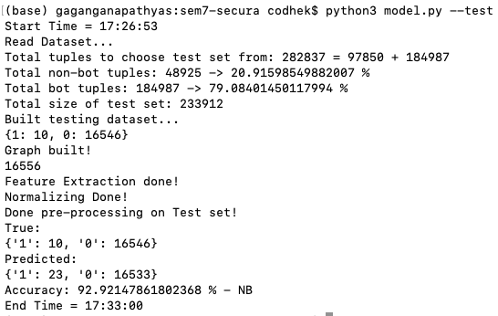
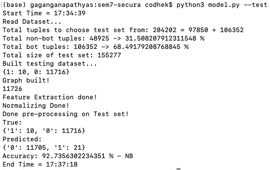
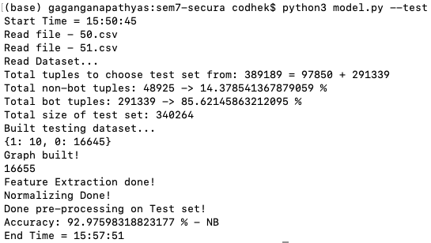

# mitiBot
A Graph based machine learning approach to bot mitigation systems.

### Datasets

Step 1:
  ```
  mkdir datasets
  ```

Step 2:
  Use curl to install the required data files from [https://www.stratosphereips.org/datasets-ctu13](https://www.stratosphereips.org/datasets-ctu13)

  ```
  cd datasets
  ```

  Download directly into this folder:

  Train set:
  ```
  curl https://mcfp.felk.cvut.cz/publicDatasets/CTU-Malware-Capture-Botnet-42/detailed-bidirectional-flow-labels/capture20110810.binetflow -k -o 42.csv

  curl https://mcfp.felk.cvut.cz/publicDatasets/CTU-Malware-Capture-Botnet-43/detailed-bidirectional-flow-labels/capture20110811.binetflow -k -o 43.csv

  curl https://mcfp.felk.cvut.cz/publicDatasets/CTU-Malware-Capture-Botnet-46/detailed-bidirectional-flow-labels/capture20110815-2.binetflow -k -o 46.csv

  curl https://mcfp.felk.cvut.cz/publicDatasets/CTU-Malware-Capture-Botnet-47/detailed-bidirectional-flow-labels/capture20110816.binetflow -k -o 47.csv

  curl https://mcfp.felk.cvut.cz/publicDatasets/CTU-Malware-Capture-Botnet-48/detailed-bidirectional-flow-labels/capture20110816-2.binetflow -k -o 48.csv

  curl https://mcfp.felk.cvut.cz/publicDatasets/CTU-Malware-Capture-Botnet-52/detailed-bidirectional-flow-labels/capture20110818-2.binetflow -k -o 52.csv

  curl https://mcfp.felk.cvut.cz/publicDatasets/CTU-Malware-Capture-Botnet-53/detailed-bidirectional-flow-labels/capture20110819.binetflow -k -o 53.csv
  ```

  Test set:
  ```
  curl https://mcfp.felk.cvut.cz/publicDatasets/CTU-Malware-Capture-Botnet-50/detailed-bidirectional-flow-labels/capture20110817.binetflow -k -o 50.csv

  curl https://mcfp.felk.cvut.cz/publicDatasets/CTU-Malware-Capture-Botnet-51/detailed-bidirectional-flow-labels/capture20110818.binetflow -k -o 51.csv
  ```


### Using the data files

```
b = Build(['42.csv', '43.csv', '46.csv', '47.csv', '48.csv', '52.csv', '53.csv'])
```

Just pass the file names, it will read the files from the `./datasets` directory and load the data.


### e2e mode

To perform both `training` then `testing` use the `e2e` flag.

```
python3 model.py --e2e
```

Configuration used in the e2e mode:

```
# Training dataset

b = Build(['42.csv', '43.csv', '46.csv', '47.csv', '48.csv', '52.csv', '53.csv'])
b.data = b.build_train_set(b.non_bot_tuples, b.bot_tuples)
b.preprocess()

train_p1()
train_p2()

# Testing dataset

t = Build(['50.csv', '51.csv'])
t.data = t.build_test_set(t.non_bot_tuples, t.bot_tuples, 50)
t.preprocess()

test()
```

Total time:
```
  Avg: ~45m
```


### Training

You can train the model in 2 ways, as it has PHASE 1 (UNSUPERVISED) and PHASE 2 (SUPERVISED)

This will peform both the phases one by one.
```
python3 model.py --train
```

If you want to perform the 2 phases separately
```
python3 model.py --phase1
```

and

```
python3 model.py --phase2
```

Once trained, it creates the pickle files of the model and saves it in the `saved` folder which is then used for the testing.


### Testing

Using the command below will use the pre-trained classifier saved in the pickle file in the `saved` folder.
```
python3 model.py --test
```

### Cluster sizes:
#


### DBSCAN + Naive Bayes Classifer

Tested on the data file `50.csv`.
#
Test run:
#

#
Test time:
```
  Avg: 6m-7m
```

### DBSCAN + Naive Bayes Classifer

Tested on the data file `51.csv`.
#
Test run:
#

#
Test time:
```
  Avg: 3m-4m
```

### DBSCAN + Naive Bayes Classifer

Tested on the data files `50.csv` and `51.csv`.
#
Test run:
#

#
Test time:
```
  Avg: ~7m
```

### Reference

The following code is the implementation of the [paper](https://arxiv.org/pdf/1902.08538.pdf)
with slight modifications.
